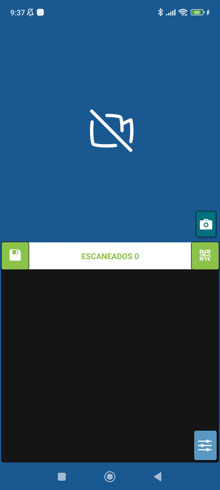

# scanTool

  

#### Aplicación móvil para escanear códigos de barras y QR, se pueden ser guardados en una lista para su posterior envio o consulta, opcion de enviar los códigos a PC al mismo momento del escaneo o al revisar la lista (por eventos de teclado, se requiere programa portable para PC). Soporte para dispositivos con escaner integrado (activar el modo desde ajustes)

# Arrancar de manera local

0. Descargar el repo como zip.

1. Instalar las dependencias, ejecuta el comando `npm install`.

2. Renombra el archivo `.env.template` a `.env` y completa los datos(se requiere API de comprobación de versiones y API para el envio de codigos a PC)

3. Ejecutar el comando `npm start`.

4. Puedes usar un emulador mobile o tu dispositivo móvil y descargar la app *Expo* para escanear el código QR que te mostrará por consola al completar el paso anterior.

# Descargar instalador para Android

APK - **<a href="https://drive.google.com/file/d/11nYEKIfKfm8wjaOzvbwzkhwX6GP6JTjJ/view?usp=drive_link" target="_blank" rel="noreferrer">scanTool</a>**

## Construido con:

- Expo
- React Native
- React Navigation
- React Redux
- Redux Toolkit

